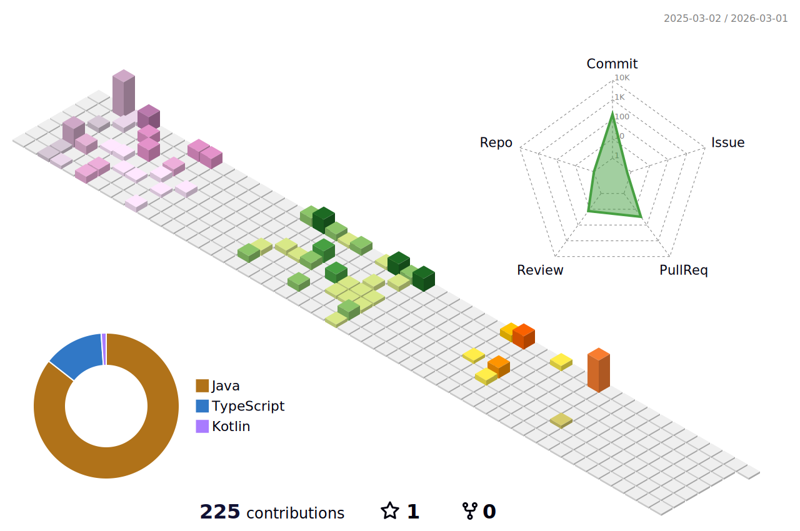

### Hi there! 👋

I am BackEnd Software Developer **Soyoung Yu** who is thinking about sustainable growth.

- 🙋‍♀️ I have a **steep learning curve** and a **challenging spirit** to constantly learn and grow.
- 🌱 I’m currently learning BackEnd, CI/CD, and Object-Oriented Programming.

### 안녕하세요! 👋

지속 가능한 성장을 고민하는 백앤드 개발자 **유소영**입니다.

- 🙋‍♀️ 저는 **가파른 학습곡선**과 **끊임없이 배우고 성장하는 도전정신**을 지니고 있습니다.
- 🌱 저는 현재 백엔드, CI/CD, 객체 지향 프로그래밍을 공부하고 있습니다.

<!--   -->
<!--      -->
  
  <!--  
  
   
    -->
  

<!-- commit log 3d로 보여주기 -->
<!--  -->
